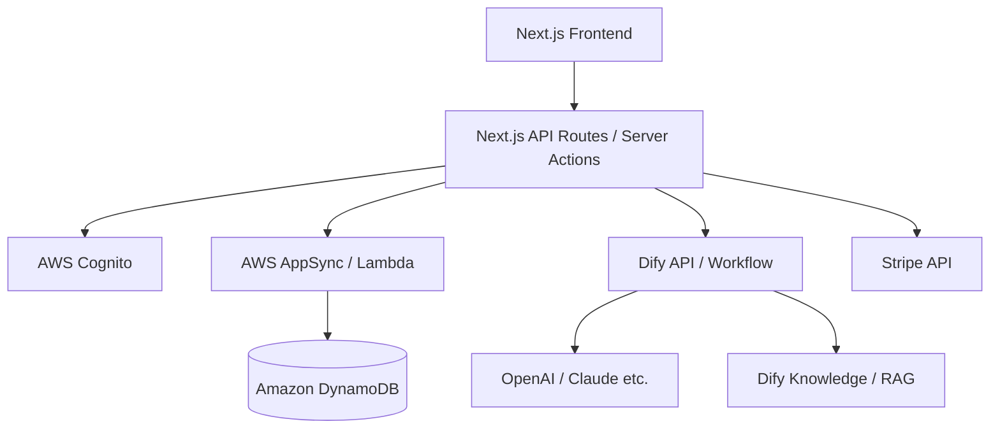

# Re:Journal システムアーキテクチャ設計書

## 1. 全体構成
本アプリケーションは、Next.jsによるBFF (Backend For Frontend) 構成を採用し、ビジネスロジックをAWS Core APIに、AIロジックをDifyに集約します。

### アーキテクチャ図

---

## 2. 技術スタック

### フロントエンド / BFF
- **Framework**: Next.js (App Router)
- **Styling**: Tailwind CSS, shadcn/ui
- **State Management**: React Server Components / SWR or TanStack Query

### バックエンド (Core API)
- **Auth**: AWS Cognito
- **API**: AWS AppSync (GraphQL) または API Gateway (REST)
- **Compute**: AWS Lambda
- **Database**: Amazon DynamoDB
- **Storage**: Amazon S3 (画像、エクスポートデータ)

### AI基盤
- **Orchestration**: **Dify**
    - ワークフロー機能によるAIロジックの構築
    - ナレッジ機能（RAG）によるユーザーコンテキストの保持

### 外部サービス
- **Payment**: Stripe (サブスクリプション管理、Checkout、Customer Portal)

---

## 3. データベース設計案

### Users Table
- `user_id` (Partition Key)
- `email`
- `stripe_customer_id`
- `plan_type` (free / premium)
- `dify_user_id`
- `last_journal_date`

### Journals Table
- `journal_id` (Partition Key)
- `user_id` (Global Secondary Index)
- `content`
- `created_at` (Sort Key)
- `duration_seconds`
- `is_re_entry` (Boolean)

### Journal_Analysis Table
- `analysis_id` (Partition Key)
- `journal_id` (Global Secondary Index)
- `sentiment_score`
- `keywords` (List)
- `ai_response` (Text)

---

## 4. Dify ワークフロー設計
1. **入力**: ユーザー投稿内容、過去のジャーナル要約、ユーザー属性。
2. **処理**:
    - 感情抽出ノード
    - 過去コンテキスト検索 (RAG)
    - 返信生成ノード (プロンプト: 「優しく、再開を肯定するトーン」)
3. **出力**: 感情スコア、AI返信テキスト。
